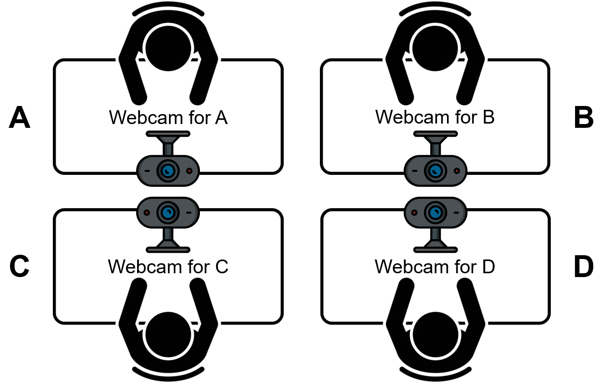
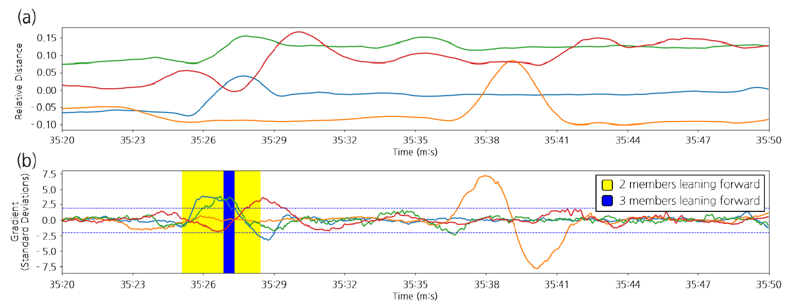

<div align="center">
  <h1>PROJECT-BS</h1>
  <p><strong>Behavioral Synchrony in Collaborative Learning</strong></p>
  <p>From facial and motion signals to measures of group coordination.</p>
</div>

<p align="center">
  <a href="#overview">Overview</a> ·
  <a href="#reference-setup">Reference Setup</a> ·
  <a href="#analysis-examples">Analysis Examples</a> ·
  <a href="#repository-structure">Structure</a> ·
  <a href="#configuration-before-use">Configuration</a> ·
  <a href="#minimal-example">Minimal Example</a>
</p>

## Overview

Extract facial and motion signals, measure behavioral synchrony, and export session summaries.

**Video → Signals → Synchrony → Session summaries**

| Method | Measures |
| :--- | :--- |
| **Event synchrony** | Concurrent behaviors within a time window |
| **Wavelet synchrony** | Coordination across participants in head motion and motion energy |

Based on an [HCIK Best Paper Award study](docs/guide.md#research). A journal manuscript combining behavioral synchrony with fNIRS is in preparation.

## Reference Setup

| Component | Version |
| :--- | :--- |
| Python | 3.12 |
| OpenFace | 2.2.0 |
| MATLAB | R2026a |
| ASToolbox | ASToolbox2018 |

FFmpeg is also required for video processing.

## Analysis Examples

Figures from the HCIK pilot study, which used FaceMesh relative distance. See the [current methods](docs/guide.md#methods) for this implementation.

<p align="center">
  <a href="docs/assets/study-setup.png"></a>
  <a href="docs/assets/behavioral-synchrony.png"></a>
</p>

<p align="center">
  <sub><strong>Left:</strong> Four-person webcam setup. <strong>Right:</strong> Relative-distance signals and simultaneous forward leaning. Click either panel to enlarge.</sub>
</p>

## Repository Structure

```text
.
├── configs/                 # Path templates and analysis indicators
├── src/bs/
│   ├── extraction/          # Video, OpenFace, and motion energy
│   ├── preprocessing/       # Feature derivation, statistics, alignment
│   ├── synchrony/           # Event and wavelet analysis
│   ├── visualization/       # Signal and synchrony timelines
│   └── reporting/           # Session summaries and Excel exports
├── docs/
│   ├── guide.md             # Technical reference
│   └── assets/              # Study illustrations
├── tests/                   # Synthetic-data analysis checks
└── pyproject.toml           # Package and dependencies
```

## Configuration Before Use

```powershell
python -m venv .venv
.\.venv\Scripts\Activate.ps1
python -m pip install -r requirements.txt
Copy-Item configs/paths.example.json configs/paths.local.json
```

Set data and tool paths in `configs/paths.local.json`, then run `bs doctor`. Adjust event thresholds in `configs/indicators.json`. See the [input formats and workflow](docs/guide.md) to prepare your data.

## Minimal Example

With augmented features and reference statistics prepared, analyze one timeline:

```powershell
bs events --semester "<semester>" --group "<group>" --week "<week>" --timeline "<timeline>"
```

Replace the placeholders with your directory identifiers. Outputs: synchrony-count and frame-mask workbooks.
